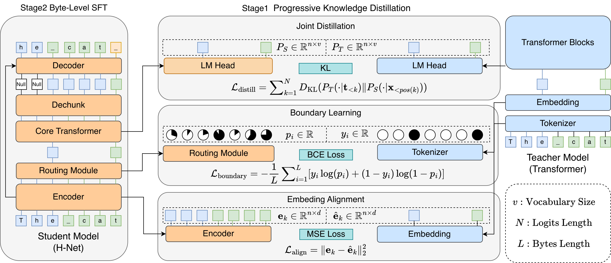

# ByteDistill

This repository contains code for our paper: "Distilling Token-Trained Models into Byte-Level Models"
- Authors: Zishuo Bao, Jiaqi Leng, Junxiong Wang, Bowen Peng, Yucheng Lu
- Paper: https://www.arxiv.org/abs/2602.01007

## Abstract
Byte Language Models (BLMs) have emerged as a promising direction for scaling language models beyond tokenization. However, existing BLMs typically require training from scratch on trillions of bytes, making them prohibitively expensive. In this paper, we propose an efficient distillation recipe that converts existing token-trained LLMs into BLMs while retaining comparable capabilities. Our recipe follows a two-stage curriculum: (1) Progressive Knowledge Distillation, which aligns byte-level representations with the embeddings of the token-trained teacher model; and (2) Byte-Level Supervised Fine-Tuning, which enables end-to-end generation entirely in the byte space. We validate our approach across multiple model families, including Llama, Qwen, and OLMo, and demonstrate that the distilled BLMs retain most of the teacher models' performance using only approximately 125B bytes.



## Key Features
- Multi-stage training: `embedding`, `routing`, `distill`, `dechunk`, `dechunk-step2`
- FineWeb preprocessing and streaming data loading
- Inference script: `generate.py`
- Evaluation entry: `eval.py`

## Quick Start
```bash
conda create -n ByteDistill python=3.12
conda activate ByteDistill
pip install -r requirements.txt
```

## Training
1. Replace placeholder paths (for example `/path/to/...`) in scripts under `scripts/train/`.
2. Run stage scripts in order:
   - `scripts/train/stage1/train_embedding_alignment.sh`
   - `scripts/train/stage1/train_boundary_learning.sh`
   - `scripts/train/stage1/train_joint_distillation.sh`
   - `scripts/train/stage2/train_byte_sft_step1.sh`
   - `scripts/train/stage2/train_byte_sft_step2.sh`

You can also launch manually:
```bash
accelerate launch --num_processes 8 train.py --run-distill \
  -c /path/to/hnet_model/config \
  --pretrain-transformer-name /path/to/pretrain_model_or_tokenizer \
  --save-dir output/joint_distillation
```

## Inference
```bash
python generate.py \
  --config-path /path/to/hnet_model/config \
  --checkpoint-path /path/to/checkpoint.pt \
  --pretrain-transformer-name /path/to/pretrain_model_or_tokenizer \
  --mode stage2 \
  --prompt "Hello" \
  --max-new-tokens 128
```

## Evaluation
```bash
bash scripts/eval/eval_script.sh
```

## Project Structure
- `hnet/`: model definitions
- `training/`: trainer, training strategies, logging, checkpointing
- `data/`: preprocessing and dataloading
- `eval/`: evaluation model adapter
- `configs/`: model configs
- `scripts/`: training and evaluation scripts

## Notes
- If your dataset directory is not the default one, use `train.py --data-dir`.
- The project is designed for multi-GPU training (`accelerate` + DeepSpeed).

## Citation
If you use this codebase, or otherwise found our work valuable, please cite:
```
@misc{bao2026distillingtokentrainedmodelsbytelevel,
      title={Distilling Token-Trained Models into Byte-Level Models}, 
      author={Zishuo Bao and Jiaqi Leng and Junxiong Wang and Bowen Peng and Yucheng Lu},
      year={2026},
      eprint={2602.01007},
      archivePrefix={arXiv},
      primaryClass={cs.CL},
      url={https://arxiv.org/abs/2602.01007}, 
}
```